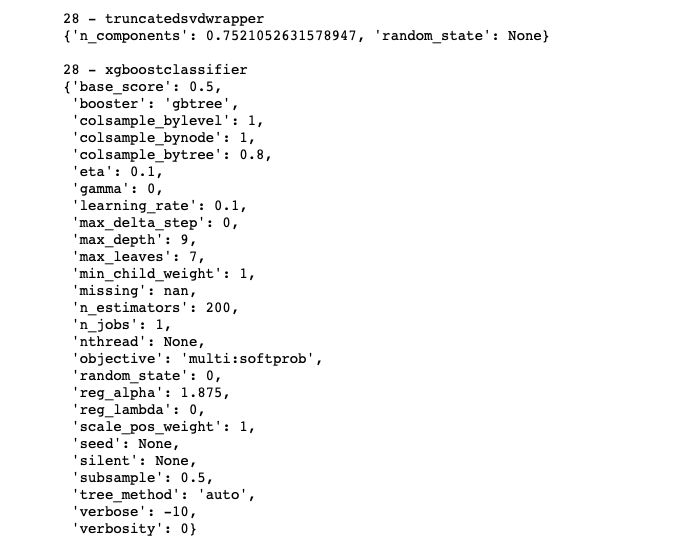

# Capstone Project for Machine Learning Engineer on Microsoft Azure

This is the final project of my Udacity Machine Learning Engineer nanodegree course. I will compare the performance of an AutoML model to an hyperparameter-optimized XGBoost classification model. For this comparison, I use the red and the white wine quality dataset and concatenate these datasets, so the resulting dataset contains information from red and white wines. The best model is a VotingEnsemble model created by AutoML.

## Dataset

### Overview
In this project I use both wine quality datasets which are available in the UCI Machine Learning data repository. One dataset only contains information about white wines, the other dataset consists of red wines. To use both datasets for the classification, I add wine type as an additional feature to both datasets and concatenate them using the pandas concat method.

The dataset contains physiochemical measurements like the pH-value, the amount of sugar or the percentage of alcohol for each wine along with a sensory rating ranging from 3 to 9 and the information whether the wine is white or red.

I convert the original ratings to a discrete feature with the values BAD, MEDIUM and GOOD using panda's cut method with the following scheme:

below 4 => "BAD"
between 4 and 6 => "MEDIUM"
7 and above => "GOOD"

### Task
The goal of this project is to predict the quality grade (BAD, MEDIUM, GOOD) of a wine. To achieve this, we use the 11 attributes from the dataset and the wine type added to the dataset. As a performance metric the AUC_weighted metric is used.

### Access
The data are accessed by searching the key "wine-quality" in the Workspace's dataset attribute. If the dataset is found in the AzureML Studio it is loaded from that resource. Otherwise the datasets for white and red wines are loaded using the from_delimited_files method of the TabularDatasetFactory class. In the clean_data function the TabularDataset are converted into pandas dataframes and the wine type is added as a new feature. Now the dataframes are concatenated and  registered as a TabularDataset in Azure Machine Learning Studio.

## Automated ML
To configure an AutoML run, an AutoMLConfig object is created. To start the AutoML run that config object is submitted as an argument of the experiment's submit method. In the following, I will describe my AutoML settings.
During my AutoML experiment, a timeout is raised after 30 minutes. This is set by the parameter experiment_timeout_minutes of the AutoMLConfig constructor. This is done to limit the training duration. Using a dictionary which is passed to the AutoML Config constructor, the number of cross validations is set to 3. This means that the dataset is partitioned into three parts. Two of these parts are used to train the model, the other part is used to test the trained model. This procedure is executed three times.

As a primary metric I use the AUC_weighted metric because this metric is less influenced by class imbalance. As you could see in the output of the AutoML run displayed in the jupyter notebook, the dataset is imbalanced, because only 246 out of 6491 wines got a bad rating.  

Because I have provisioned a compute cluster with 6 nodes, I set the number of maximum concurrent iterations to 5. This number should be less or equal to the maximum amount of core of the compute cluster.

Next I enable early stopping to save compute time, if more iterations don't lead to an improvement of the performance metric. In this case, the child run is cancelled. During my AutoML experiment I don't use deep learning to train a model, which is the default. By setting the parameter enable_dnn, deep learning models are trained on the dataset. I have decided not to use deep learning techniques in my project, as they need more data to achieve superior performance compared to standard models.

### Results
Like in the other Udacity projects, the best model returned by AutoML is a Voting Ensemble model.

Below you could find the output of the RunDetails widget. It provides useful information about the state of the child runs, the achieved performance and the duration of all completed runs.

In the screenshot above the best AutoML run is displayed with its Run ID and other information. The second screenshot shows information about the model trained by AutoML like the type of model (Voting Ensemble), the achieved AUC_weighted and the registration status.

The classification algorithms involved in the VotingEnsemble are XGBoost and LightGBM. The Voting Ensemble is a combination of multiple XGBoost and LightGBM models with different parameters. In the following I will provide some information about the parameters of the classification algorithms XGBoost and LightGBM. XGBoost uses gradient boosting to optimize decision trees. Training models on the errors of prior trained models, could lead to a superior performance because errors made by other models are corrected by another model. The parameters of the XGBoost and logistic regression models are optimized during the training process.

 Here you could find some information about the base models and their parameters of the Voting Ensemble model trained by AutoML.

 The Voting Ensemble consists of nine different base models and the final prediction is obtained via a weighted voting principle. The weights used in the voting process are displayed in the screenshot below. For each base model the data are transformed before the model is trained using different types of data transformers like StandardScaler, TruncatedSVD or SparseNormalizer.

 

 The first model involved in the Voting Ensemble is a XGBoost model with a StandardScaler as a preprocessing step. The parameters of this model are printed in the screenshot below.

The next base model of the Voting Ensemble is another XGBoost model which was trained on other parameters compared to the model described above. Its parameters are displayed in the screenshot below. As you can clearly see, this model uses another value for the learning rate (0.4 compared to 0.05) and uses a higher regularization strength for the weights.

The LightGBM model, which also plays a role in the Voting Ensemble, is also based on trees. like XGBoost, but has a higher computational efficiency. The optimal parameters of this model are listed in the screenshot below. As a preprocessing step, the data is scaled using a normal distribution.

Another XGBoost model involved in the Voting Ensemble uses a learning rate of 0.3 and a less strict regularization of weights compared to the XGBoost Model with the ID 34.
The values for all parameters for this model are provided in the screenshot below. Like the models described above the data is standardized before the models are fitted.

The model with the ID 63 is also a XGBoost model with a quite high learning rate of 0.5. In contrast to the model described above, the whole training dataset is used to train the XGBoost model, because the subsample parameter is set to 1. You could find the complete parameter set in the screenshot below.

The next base model is also a XGBBoost classifier with the parameters printed below. As a preprocessing step, the data is transformed using a TruncatedSVD algorithm.

The screenshot below show the parameters of another base model involved in the Voting Ensemble. It uses the classification algorithm XGBoost and the data is normalized using a SparseNormalizer before the training process.

The next model involved in the Voting Ensemble is also a XGBoost classifier. The SparseNormalizer is used to normalize the data using the maximum norm. The parameters of the preprocessing step and the hyperparameters of the XGBoost classifier could be obtained from the screenshot below.

The last model which is part of the Voting Ensemble is another XGBoost model with a L1 regularization of the XGBoost's weights. The data is preprocessed using a TruncatedSVD algorithm. All parameters of this model are listed below.

All predictions of the base models described above are evaluated and averaged using the set of weights which are displayed in the first screenshot showing the PrefittedSoftVotingClassifier.

So the Voting Ensemble achieves a AUC_weighted of 0.87556.

An interesting improvement to the project would be to enable the training of deep learning models just to test whether they could outperform the VotingEnsemble model. Another room of improvement deliver the parameters blocked models or allowed models or a manual feature engineering on the dataset.

## Hyperparameter Tuning

I chose the XGBoost classification algorithm to perform the outlined task, because these models often have good performance. XGBoost is an abbreviation for eXtreme Gradient Boosting. Gradient Boosting is an ensemble technique. This means that you aggregate the predictions from so-called base learners (here: decision trees). Because of the aggregation of their predictions the error rate will be reduced compared to the error rate from a single decision tree.
Another positive property of XGBoost is its speed.

The XGBoost classification algorithm has many important hyperparameters like the learning rate, sampling size and the parameters for the decision tree like the maximum depth or a lower bound for the loss reduction incurred by a new split of the decision tree. During my experiments, I will optimize the four hyperparameters below:
|Parameter | description | range | optimal value |
|----------|------------ |-------|------------ |
|Maximum Depth | depth of decision tree | random integer between 3 and 8 | 7 |
| alpha | L1 regularization on weights of XGBoost | random between 0.1 and 10 |0.2525 |
| Gamma | minimal split loss required for next split| between 0.01 and 5 | 0.01 |
| Learning rate | learning rate used to optimize weights | random between 0.05 and 0.25 | 0.05 |

The maximum depth hyperparameter refers to the maximum depth of the decision trees involved in the algorithm. Gamma is another hyperparameter of a decision tree: a split of a leaf of the decision tree is only performed, if the loss is reduced by gamma by splitting the tree.

The next hyperparameter I would like to optimize is alpha, which provides a L1 regularization to the weights. This regularization of the weights is used to prevent overfitting. Another important parameter I will use is the learning rate. The learning rate is a parameter used in the optimization problem to find the right weights for the ensemble learner.

I use BayesianParameterSampling in my experiments because BayesianParameterSampling is able to learn from prior runs which could lead to better hyperparameters. Because I use this sampling strategy a Policy to cancel runs is not required. I use AUC_weighted as a metric to evaluate the performance. To run my train.py script which is used to train my XGBoost model, a SKLearn estimator is used. The estimator object is passed to the HyperdriveConfig object along with a max_total_runs of 80 and a maximum amount of concurrent runs of 5. I chose 80 as the maximum number of runs because if you specify less than 20 * {number of hyperparameters} when using the Bayesian sampling strategy, you will get a warning that you should allow at least 20 * {number of hyperparameters} runs.
The HyperdriveConfig is submitted to a new experiment and the hyperdrive runs are executed automatically.   

### Results

The hyperparameter-optimized XGBoost classification model achieves a AUC_weighted metric of 0.8689. The optimal hyperparameters are displayed in the table showing information about the hyperparameters being tuned above.

The model performance could be improved by choosing a deep learning model as a classifier and using Hyperdrive to tune the hyperparameters of the deep learning algorithm. Another interesting idea is to use another sampling strategy like RandomParameterSampling or a grid search combined with a Policy like the Bandit-Policy. Policies could be used to cancel runs with a smaller performance compared to the highest performance achieved during this experiment.
The screenshots below shows the RunDetails widget which displays the state of all runs with their parameters and the performance. You could see that the run is completed and took about 43 min to complete.

The screenshot below shows some information about the hyperdrive runs like the run id, the metric and the values for all hyperparameters in this run. The hyperdrive runs are sorted by the performance, so the first row displays the best hyperdrive run. The hyper parameters of the best model can be found below.

## Model Deployment

During my experiment the AutoML model has a better performance compared to the hyperparameter-tuned XGBoost model. So I deployed the model created by AutoML as a Azure Container Instance (ACI) with enabled authentication.

To query the endpoint of the best model with a sample input, I use the requests module. The sample input has to be provided as a json serialized dict containing the data under the key named "data". Each instance is another dict in the array which is the value corresponding to the data key. The sample data is serialized using the dumps method of the json module.

Because I have activated authentication for my REST endpoint an authentication header with the string Bearer and the primary key which was created when the endpoint was created has to be included. The URI of the endpoint, the header containing authentication data and the json payload should be passed to the post method of the requests module. This sends a POST request to the endpoint. The endpoint will provide a prediction for the instances to be scored and return it as a json string to the client. In the screenshot below you could find a sample input along with the response by the deployed model's endpoint. The code and the response by the model's REST endpoint is displayed in the screenshot below.

## Further improvements
In this section I will elaborate on possible improvements of this project. The first improvement I want to mention is the usage of deep learning for AutoML. By setting the parameter enable_dnn to true, deep learning is included in the set of algorithms of AutoML. This could lead to a higher performance.

Another improvement for this project would be the optimization of the hyperparameters of a neural network using Hyperdrive to get the chance to achieve superior performance compared to XGBoost.

As you could see in the output of the AutoML run the wine dataset is imbalanced. Using a resampling technique like SMOTE would help to improve the classifiers performance because there is no minority class in the resampled sample.

## Screen Recording
You will find my screencast video under https://...
